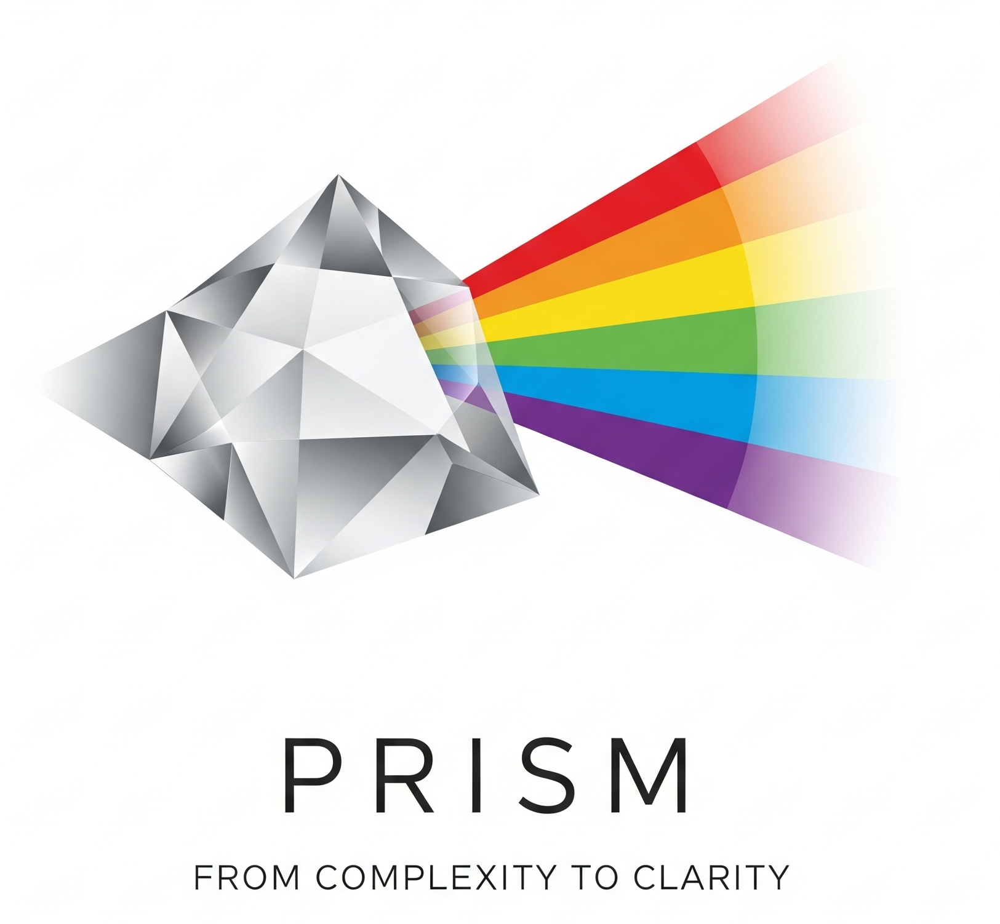
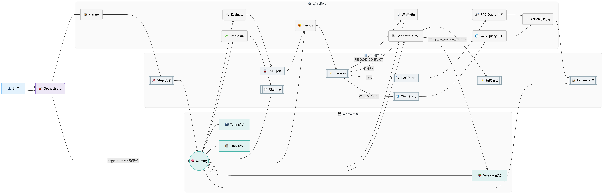

#  Prism

**From complexity to clarity** - 聚焦复杂，折射洞见

Prism 是一个基于大语言模型的深度研究系统，通过多轮对话和递进式研究，帮助用户从海量信息中提炼出有价值的见解。系统采用智能体架构，具备完整的记忆层次、动态规划能力和实时监控功能。

## 📺 演示效果

### 🔬 研究过程展示


### 🧠 记忆监控系统


## 📖 简介

Prism 采用先进的 Agent 架构设计，能够像经验丰富的研究员一样，通过多步骤、多维度的方式探索复杂问题。

### 系统特点

- **🎯 智能规划**：自动分解研究任务，制定合理的探索路径
- **🧠 层次记忆**：四层记忆架构（Session/Turn/Plan/Action），确保研究的连贯性
- **📊 质量评估**：五维度评估体系，保证研究结果的可靠性
- **🔄 动态决策**：根据研究进展自适应调整策略
- **👁️ 实时监控**：可视化展示研究过程和记忆变化

### Agent 运行机制



系统的核心运行流程：

1. **规划阶段**：接收用户问题后，Agent 将其分解为多个研究步骤
2. **执行循环**：
   - **评估（Evaluate）**：评估当前研究状态的完整性
   - **决策（Decide）**：基于评估结果决定下一步行动
   - **执行（Execute）**：通过 RAG 或 Web 搜索获取信息，或通过冲突求解器澄清冲突观点。
   - **理解（Synthesize）**：将新信息整合为结构化观点
3. **输出生成**：将所有观点整合为连贯的研究报告

### 记忆层次架构

- **Session Memory**：跨轮次的持久记忆，保存会话配置和归档
- **Turn Memory**：单轮对话的工作记忆，包含查询、证据和观点
- **Plan Memory**：研究计划的执行状态和修改历史
- **Action Memory**：具体操作的执行日志和成本追踪

## 🚀 快速开始

### 环境要求

- Python 3.8+
- 稳定的网络连接

### 安装步骤

1. 克隆项目
```bash
git clone https://github.com/your-repo/prism.git
cd prism
```

2. 安装依赖
```bash
pip install -r requirements.txt
```

3. 配置 API

本系统使用**通义千问系列模型**。请先在 [阿里云百炼平台](https://bailian.console.aliyun.com/?spm=5176.29619931.J_AHgvE-XDhTWrtotIBlDQQ.13.225b521c3h0V4L&tab=home#/home) 获取 API Key.您也可以使用其他平台的 LLM API。

编辑 `config.json` 文件，填入您的模型配置信息：
```json
{
  "llm": {
    "api_key": "sk-xxxxxxxxxxxxxxxx",  
    "base_url": "https://dashscope.aliyuncs.com/xxxxxxxxxxxxxxxx",
    "model": "qwen-flash",  
    ...
  }
}
```

### 运行系统

#### 基础启动
```bash
python start.py
```

#### 带监控面板启动
```bash
python start.py --open-browser
```

#### 运行示例对话
```bash
python start.py --example
```

### 使用方式

1. **交互式研究**：启动后直接输入研究问题，系统会自动进行深度探索
2. **多轮对话**：支持基于上下文的连续提问，深入挖掘特定主题
3. **实时监控**：通过 Web 界面查看研究进展和记忆状态变化

### 配置说明

`config.json` 主要配置项：

- `llm.model`：使用的模型（默认：qwen-flash）
- `research.thresholds`：研究质量阈值设置
- `research.max_loops_per_turn`：每轮最大循环次数
- `monitor.port`：监控服务端口（默认：5678）

## 🔮 未来规划

### 近期计划

- [ ] **真实 RAG 服务集成**
  - 目前使用 LLM 模拟 RAG 检索
  - 计划接入向量数据库和专业知识库
  
- [ ] **Web Search API 集成**
  - 当前通过 LLM 生成模拟搜索结果
  - 将接入 Google/Bing 等真实搜索 API
  
- [ ] **异步记忆压缩**
  - 实现后台记忆整理和压缩
  - 优化长对话场景下的记忆效率

### 长期愿景

- [ ] **多模态支持**：支持图像、表格等多种信息源
- [ ] **协作研究**：多 Agent 协同工作模式
- [ ] **知识图谱**：构建动态知识网络
- [ ] **插件系统**：支持自定义数据源和处理流程

## 🏗️ 项目结构

```
prism/
├── config/                # 配置管理
├── core/                  # 核心系统
│   ├── acts/             # Agent 动作模块
│   ├── memory.py         # 记忆管理系统
│   └── monitor_server.py # 监控服务
├── llm/                  # LLM 接口
├── docs/                 # 文档
├── config.json           # 配置文件
├── multi_turn_demo.py    # 多轮对话演示
├── requirements.txt      # 依赖列表
└── start.py             # 启动脚本
```

## 🤝 贡献指南

欢迎提交 Issue 和 Pull Request！请确保：

1. 代码符合项目风格
2. 添加必要的测试
3. 更新相关文档

## 📄 许可证

MIT License

---

**Prism** - 聚焦复杂，折射洞见 ✨
